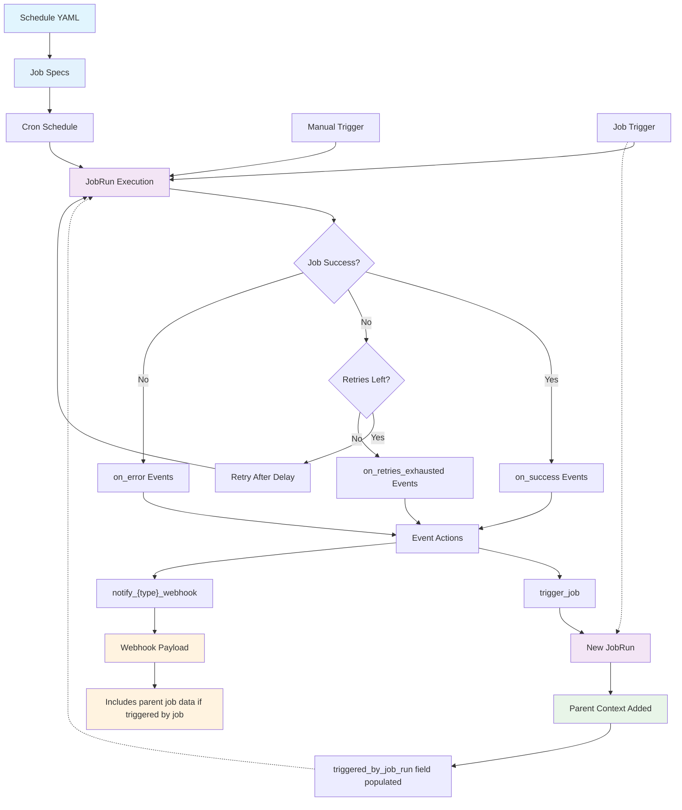

# cheek


[](https://dataroots.io/) [](https://codecov.io/gh/datarootsio/cheek)

[](https://goreportcard.com/report/github.com/datarootsio/cheek)
[](https://pkg.go.dev/github.com/datarootsio/cheek)
[](https://github.com/avelino/awesome-go)


`cheek` is a pico-sized declarative job scheduler designed to excel in a single-node environment. `cheek` aims to be lightweight, stand-alone and simple. It does not compete for robustness.

> 📄 This bump to v1 introduces a storage backend switch, moving from jsonline logs to sqlite. This might introduce the need to adjust your long-term log storage approach.

## Getting started

Fetch the latest version for your system below.

[darwin-arm64](https://github.com/datarootsio/cheek/releases/latest/download/cheek-darwin-arm64) |
[darwin-amd64](https://github.com/datarootsio/cheek/releases/latest/download/cheek-darwin-amd64) |
[linux-386](https://github.com/datarootsio/cheek/releases/latest/download/cheek-linux-386) |
[linux-arm64](https://github.com/datarootsio/cheek/releases/latest/download/cheek-linux-arm64) |
[linux-amd64](https://github.com/datarootsio/cheek/releases/latest/download/cheek-linux-amd64)

You can (for example) fetch it like below, make it executable and run it. Optionally put `cheek` on your `PATH`.

```sh
curl -L https://github.com/datarootsio/cheek/releases/latest/download/cheek-darwin-amd64 -o cheek
chmod +x cheek
./cheek
```

Everything about how you want the scheduler to function is defined in a schedule specification written in YAML. Start by creating this specification using the below example. Note, this structure should be more or less self-explanatory, if it is not, create an [issue](https://github.com/datarootsio/cheek/issues).

```yaml
tz_location: Europe/Brussels # optionally set timezone to adhere to
jobs:
  foo:
    command: date
    cron: "* * * * *" # a cron string to specify when to run
    on_success:
      trigger_job: # trigger something on run
        - bar
  bar:
    command: # command to run, use a list if you want to pass args
      - echo
      - $foo
    env: # you can pass env variables
      foo: bar
  other_workingdir:
    command: pwd
    working_directory: ../testdata # specify the working directory of the job
  coffee:
    command: this fails
    cron: "* * * * *"
    retries: 3
    disable_concurrent_execution: true # prevent concurrent runs of this job (defaults to false)
    on_error:
      notify_webhook: # notify something on error
        - https://webhook.site/4b732eb4-ba10-4a84-8f6b-30167b2f2762
      notify_slack_webhook: # notify slack via a slack compatible webhook
        - https://webhook.site/048ff47f-9ef5-43fb-9375-a795a8c5cbf5
      notify_discord_webhook: # notify discord via a discord compatible webhook
        - https://discord.com/api/webhooks/user/token
```

If your `command` requires arguments, please make sure to pass them as an array like in `foo_job`.

Note that you can set `tz_location` if the system time of where you run your service is not to your liking.

## Scheduler

The core of `cheek` consists of a scheduler that uses the schedule specs defined in your `yaml` file to trigger jobs when they are due.

You can launch the scheduler via:

```sh
cheek run ./path/to/my-schedule.yaml
```

Check out `cheek run --help` for configuration options.

## Web UI

`cheek` ships with a web UI that by default gets launched on port `8081`. You can define the port on which it is accessible via the `--port` flag.


You can access the UI by navigating to `http://localhost:8081`. When `cheek` is deployed you are recommended to NOT make this port publicly accessible, instead navigate to the UI via an SSH tunnel.

The UI allows to get a quick overview on jobs that have run, that error'd and their logs. It basically does this by fetching the state of the scheduler and by reading the logs that (per job) get written to `$HOME/.cheek/`. Note that you can ignore these logs, output of jobs will always go to stdout as well.

Note, `cheek` prior to version `0.3.0` originally used to boast a TUI, which has since been removed.

## Configuration

All configuration options are available by checking out `cheek --help` or the help of its subcommands (e.g. `cheek run --help`).

Configuration can be passed as flags to the `cheek` CLI directly. All configuration flags are also possible to set via environment variables. The following environment variables are available, they will override the default and/or set value of their similarly named CLI flags (without the prefix): `CHEEK_PORT`, `CHEEK_SUPPRESSLOGS`, `CHEEK_LOGLEVEL`, `CHEEK_PRETTY`, `CHEEK_HOMEDIR`.

## Events & Notifications

There are three types of event you can hook into: `on_success`, `on_error`, and `on_retries_exhausted`. The first two events materialize after an (attempted) job run, while `on_retries_exhausted` fires only once when a job with retries configured fails all attempts. Three types of actions can be taken as a response: `notify_webhook`, `notify_slack_webhook`, `notify_discord_webhook` and `trigger_job`. See the example below. Definition of these event actions can be done on job level or at schedule level, in the latter case it will apply to all jobs.

```yaml
on_success:
  notify_webhook:
    - https://webhook.site/e33464a3-1a4f-4f1a-99d3-743364c6b10f
jobs:
  coffee:
    command: this fails # this will create on_error event
    cron: "* * * * *"
    retries: 3 # retry up to 3 times before giving up
    on_error:
      notify_webhook: # fires after each failed attempt
        - https://webhook.site/e33464a3-1a4f-4f1a-99d3-743364c6b10f
    on_retries_exhausted:
      trigger_job: # only fires once when all retries fail
        - cleanup_job
      notify_webhook:
        - https://webhook.site/critical-alerts
  beans:
    command: echo grind # this will create on_success event
    cron: "* * * * *"
```

Webhooks are a generic way to push notifications to a plethora of tools. There is a generic way to do this via the `notify_webhook` option or a Slack-compatible one via `notify_slack_webhook` or a Discord-compatible one via `notify_discord_webhook`.

The `notify_webhook` sends a JSON payload to your webhook url with the following structure:

```json
{
	"status": 0,
	"log": "I'm a teapot, not a coffee machine!",
	"name": "TeapotTask",
	"triggered_at": "2023-04-01T12:00:00Z",
	"triggered_by": "CoffeeRequestButton",
	"triggered": ["CoffeeMachine"], // this job triggered another one
	"retry_attempt": 2, // which retry attempt this was (0 = first attempt)
	"retries_exhausted": true, // true when all retries have been exhausted
	"triggered_by_job_run": { // parent job context when triggered by another job
		"status": 0,
		"log": "Parent job completed successfully",
		"name": "ParentJob",
		"triggered_at": "2023-04-01T11:59:00Z",
		"triggered_by": "cron"
	}
}
```

When a job is triggered by another job via `trigger_job`, the webhook payload includes a `triggered_by_job_run` field containing the complete context of the parent job that triggered it. This provides full visibility into the job execution chain and allows for more sophisticated workflow tracking and debugging.

The `notify_slack_webhook` sends a JSON payload to your Slack webhook url with the following structure (which is Slack app compatible):

```json
{
	"text": "TeapotTask (exitcode 0):\nI'm a teapot, not a coffee machine!"
}
```

The `notify_discord_webhook` sends a JSON payload to your Discord webhook url with the following structure (which is Discord app compatible):

```json
{
	"content": "TeapotTask (exitcode 0):\nI'm a teapot, not a coffee machine!"
}
```

## Job Execution Flow

The following diagram illustrates how jobs flow from schedule to execution and how events trigger subsequent actions:



## Docker

Check out the `Dockerfile.example` for an example on how to use `cheek` within the context of a Docker container. Note that this builds upon a published Ubuntu-based image build that you can find in the base [Dockerfile](https://github.com/datarootsio/cheek/blob/main/Dockerfile).

Prebuilt images are available at `ghcr.io/datarootsio/cheek:latest` where `latest` can be replaced by a version tag. Check out the [available images](https://github.com/datarootsio/cheek/pkgs/container/cheek) for an overview on available tags.

## Available versions

If you want to pin your setup to a specific version of `cheek` you can use the following template to fetch your `cheek` binary:

- latest version: https://github.com/datarootsio/cheek/releases/latest/download/cheek-{os}-{arch}
- tagged version: https://github.com/datarootsio/cheek/releases/download/{tag}/cheek-{os}-{arch}

Where:

- `os` is one of `linux`, `darwin`
- `arch` is one of `amd64`, `arm64`, `386`
- `tag` is one the [available tags](https://github.com/datarootsio/cheek/tags)

## Acknowledgements

`cheek` is building on top of many great OSS assets. Noteable thanks goes to:

- [gronx](https://github.com/adhocore/gronx): for allowing me not to worry about CRON strings.

<br/>
 

